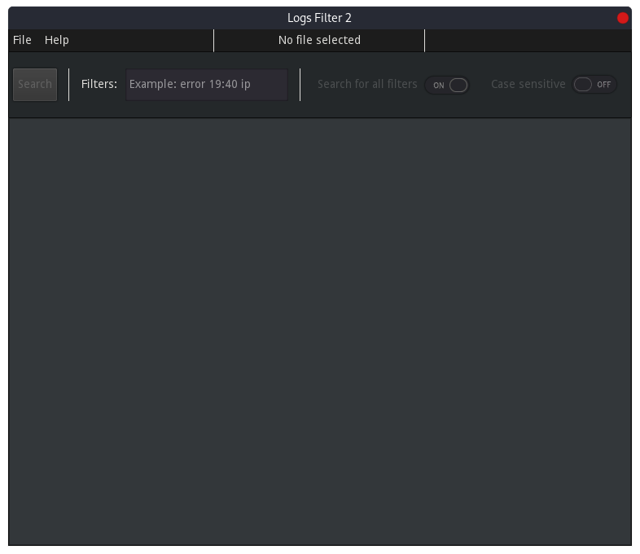
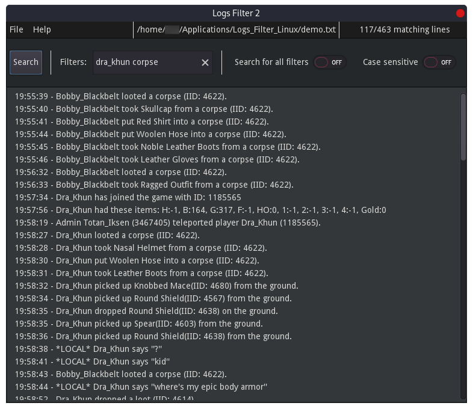
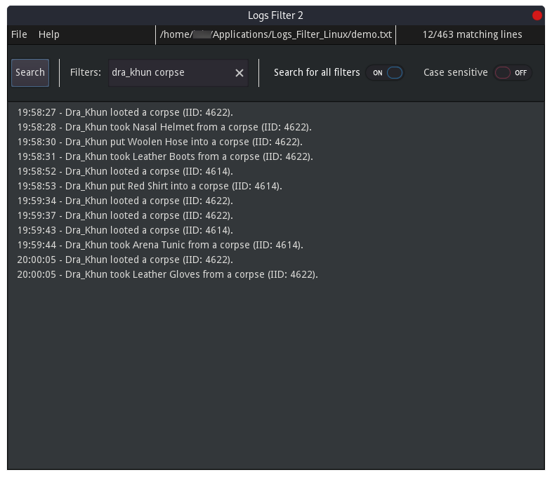

# Logs_Filter_2

## What does this project do?

This project is a lightweight user-friendly software which filters logs.

**This is a re-write of my previous project** [Lyaaaaa's Logs Filter](https://github.com/Lyaaaaaaaaaaaaaaa/Lyaaaaa-s-Logs-Filter). This aims at being more portable, faster and easier to maintain. 

## Looking for help!
**I'm looking for contributors to improve the GUI**. If you are interested in contributing read the [How to contribute](https://github.com/Lyaaaaaaaaaaaaaaa/Logs_Filter_2/blob/Master/management/CONTRIBUTING.md). If you have any question feel free to [contact me](https://github.com/Lyaaaaaaaaaaaaaaa/Logs_Filter_2/blob/Master/management/CONTRIBUTING.md#how-can-you-get-in-touch-with-me).
Other contributions are welcome as well.

## Functionalities 

- **Efficiently search through logs** - ctrl+f isn't efficient for big files
- **Start by casting a wide net** - By setting `Search for all filters` to off
 you can fetch all the lines where at least one filter appears.
- **Sharpen your search** - By setting `Search for all filters` to on you can
 fetch the lines where all your filters appear.
- **Disable/Enable case sensitivity**
- **See in real time the statistics of your search** - The number of lines 
searched and the number of lines matching your filters are displayed in the top
right-hand corner of the application.
- **Copy to the clipboard** - In one click you can copy the whole output into your
clipboard.
- **Saved preferences** - You can change the size, style or color of the font 
and more.

## Why is this project useful?
It is more efficient and more readable for sizeable files. Ctrl+f is limited when you need a clear and readable output. Moreover, this project accepts multiple filters. Not everyone has knowledge in Linux/Windows terminal. The software comes with a simple interface.

## Preview

*You can search for lines where at least one of your filters appears*

*Or you can search for lines where they all appear*

## Installation

1. Download the [latest release](https://github.com/Lyaaaaaaaaaaaaaaa/Logs_Filter_2/releases/latest) of your system
2. Extract the zip
3. Run the application.

## Building from sources

1. Install [Godot Engine](https://godotengine.org/download/)
2. [Download](https://github.com/Lyaaaaaaaaaaaaaaa/Logs_Filter_2/archive/refs/heads/Master.zip) the master branch
3. Unzip the archive
4. Open Godot Engine and scan `Logs_Filter_2` folder.
4. Open the project `Logs Filter 2` in Godot Engine's projects list.
5. [Export the project](https://docs.godotengine.org/en/stable/getting_started/step_by_step/exporting.html#export-templates) with Godot Engine.

## More information:
[Code of conduct](https://github.com/Lyaaaaaaaaaaaaaaa/Logs_Filter_2/blob/Master/management/CODE_OF_CONDUCT.md)

[How to contribute](https://github.com/Lyaaaaaaaaaaaaaaa/Logs_Filter_2/blob/Master/management/CONTRIBUTING.md)
