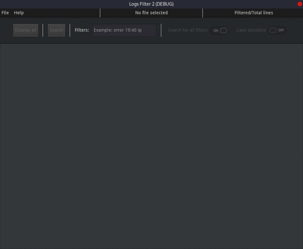

# Logs Filter 2

## Features

- **Efficiently search through logs** - ctrl+f isn't efficient for big files
- **Start by casting a wide net** - By setting `Search for all filters` to off
 you can fetch all the lines where at least one filter appears.
- **Sharpen your search** - By setting `Search for all filters` to on you can
 fetch the lines where all your filters appear.
- **Disable/Enable case sensitivity**
- **See in real time the statistics of your search** - The number of lines 
searched and the number of lines matching your filters is displayed in the top
right-hand corner of the application.
- **Copy to the clipboard** - In one click you can copy the whole output into your
clipboard.
- **Saved preferences** - You can change the size, style or color of the font 
and more.
- **Drag and drop** - Don't waste time! Drag your log file directly into the software.

## Preview

## Why would you use Logs Filter 2 instead of CRTL+F?

It is more efficient and more readable for sizeable files. Ctrl+f is limited when you need a clear and readable output. Moreover, this project accepts multiple filters. Not everyone has knowledge in Linux/Windows terminal. The software comes with a simple interface.

## Download

<iframe src="https://itch.io/embed/1163538?bg_color=252525&amp;fg_color=e8e8e8&amp;link_color=FFEB9B&amp;border_color=5d5d5d" width="552" height="167" frameborder="0"><a href="https://lyaaaaaaaaaaaaaaa.itch.io/logs-filter-2">Logs Filter 2 by Lyaaaaaaaaaaaaaaa</a></iframe>

### Installation

1. Download the lastest version (Supports Linux, Windows and MacOS)
   - On [Itch.io](https://lyaaaaaaaaaaaaaaa.itch.io/logs-filter-2)
   - On [GitHub](https://github.com/Lyaaaaaaaaaaaaaaa/Logs_Filter_2/releases/latest)
3. Extract the zip
4. Run the application.

---

## Contact and support 

### Contact
You can get in touch with me on Discord.
You just have to join my [server](https://discord.gg/hSey9Bv).
If you are old school, you can send me a mail at lyaaaaaaaaaaaaaaa@protonmail.com.

### Support

### Contributions

If you want to contribute to my project read the [How to contribute](https://github.com/Lyaaaaaaaaaaaaaaa/Logs_Filter_2/blob/Master/management/CONTRIBUTING.md).

### Suggestions

If you want to suggest features, create a discussion in [here](https://github.com/Lyaaaaaaaaaaaaaaa/Logs_Filter_2/discussions).

### Report errors

If you need to report a bug make sure you read the [Code of conduct](https://github.com/Lyaaaaaaaaaaaaaaa/Logs_Filter_2/blob/Master/management/CODE_OF_CONDUCT.md) before opening an issue [here](https://github.com/Lyaaaaaaaaaaaaaaa/Logs_Filter_2/issues)
